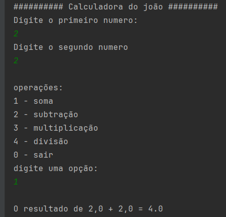

# **Calculadora Java**

Este projeto é uma calculadora simples desenvolvida em Java que realiza as quatro operações matemáticas básicas: adição, subtração, multiplicação e divisão.

## **Pré-requisitos**

Antes de executar o projeto, certifique-se de que você possui os seguintes itens instalados:

1. [Java JDK 8 ou superior](https://www.oracle.com/java/technologies/javase-downloads.html);
2. Um editor de código ou IDE, como [IntelliJ IDEA](https://www.jetbrains.com/idea/) ou [Eclipse](https://www.eclipse.org/ide/);

## **Uso**

Siga as etapas abaixo para executar o projeto:

### **1. Clonar o repositório**

Clone este repositório para sua máquina local:

```bash
git clone git@github.com:joaocandidozup/Calculadora.git
```
### *2. Executar o projeto*
abra o projeto no intellij IDE e digite as teclas **shif + f10**

### *3. Exemplo de uso*
Ao executar o programa, você será solicitado a inserir dois números e escolher uma opção. Veja um exemplo de interação: 



## Contrubuição
Contribuições são bem-vindas! Sinta-se à vontade para enviar pull requests para melhorias.

Divirta-se calculando! 😊
